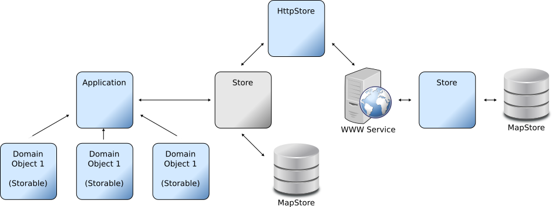

StorEd Data Repository
======================
*Solution Design v1.0*

Status: In-Development

Authors:

 Name               | Contact                                    | Company                                
--------------------|--------------------------------------------|----------------------------------------
 Christian Saunders | [cps@kilobit.ca](mailto://cps@kilobit.ca)  | [Kilobit Labs Inc.](http://kilobit.ca) 

Updates:

Date        | Type              | Author(s)          | Description               
------------|-------------------|--------------------|---------------------------
Nov 14, 201 | Document Creation | Christian Saunders | Initial document written. 

Problem Description
-------------------

Most applications require data storage.  Storage is a large and
complex issue and as such has spawned a whole sub industry with the
aim of providing storage solutions appropriate to a whole range of
applications and data types.

This design is not meant to solve storage issues.

This design is meant to make is easier to solve storage issues
and particularly to provide an efficient means of adopting the right
solution for the current circumstances of the application.

Consider some of the scenarios where different storage solutions are
appropriate:

- Prototyping and development where permanent storage is not necessary
  but speed of setup and simplicity are required.  An in-memory
  storage solution may be sufficient and it is easy to set up.
- A fledgling application or MVP where time to market is essential,
  requiring safe storage for data with a relatively small but growing
  number of users.  Cloud storage may be an economical choice at this
  stage.
- An application supporting a medium sized user base where cloud based
  storage starts to become expensive and may potentially become
  prohibitive.  A separately managed data layer may provide a more
  economical solution.
- A large scale application requiring highly redundant large scale
  data, hosted in a secure location.
- A decentralized application where data storage requirements are
  pushed to the network, reducing costs and democratizing the
  application.
  
These scenarios should be considered use cases for the solution.
  
The best storage solution for each of these scenarios is significantly
different and requires different ways of integrating them.  It is
almost certain that a successful application will move from one of
these scenarios to another over the course of it's development.
Drastic and expensive changes could be required if data architecture
is not considered from the beginning.

Glossary
--------

Please refer to this list of terminology for the purposes of this
design.

- **Data** - Data is any information that can be encoded and stored in the
  running of an application.

- **Encoding / Decoding** - The process of representing a data object in some specified digital
format (e.g. JSON, urlencoded, csv, binary dump etc).

- **Storage** - The process of saving data for retrieval at a later time.

- **Storage Back-End** - The final resting place of the bits representing some data.

  Note that there may be multiple storage back-ends containing a data
  element or that the bits making up a data element may be stored across
  multiple back-ends.

Requirements
------------

Consider RFC2119 in interpreting the following requirements.

Functional:

ID   | Description                                                                                   
-----|-----------------------------------------------------------------------------------------------
FR1  | The system will provide a means of storing/retrieving data.                                   
FR2  | The system should provide a means of deleting data.                                           
FR3  | The system may provide a means of processing data.                                            
FR4  | The system may provide addition data operations.                                              
FR5  | The system will provide a means of determining supported operations for the current back end. 
FR6  | The system will provide an interface for arbitrary storage back-ends.                         
FR7  | The system will provide a standard interface for encoding data.                               
FR8  | The system will provide a standard interface for decoding data.                               
FR9  | The system will provide an in-memory back-end store implementation.                          
FR10 | The system will provide a HTTP based back-end store implementation.                           

Non-Functional

ID  | Type        | Description                                                                     
----|-------------|---------------------------------------------------------------------------------
NR1 | Constraint  | The system will not impose any limitation on the type of the data being stored. 
NR2 | Constraint  | The application developer will be able to determine how domain data is encoded. 
NR3 | Constraint  | The back-end storage system will determine suitable data encoding.              
NR4 | Performance | The system will not incur overhead beyond constant time and memory.             
NR5 | Constraint  | Any store that can be instantiated will be supported.                           

Solution
--------

The StorEd system is a Golang implementation of the Repository pattern
as described in [PEAA](#references).  Several standard back-end
implementations will be provided allowing data to be stored in-memory,
using the standard golang database driver or via a configurable remote
REST api.

Principles of the solution:

- Simple
- Modular
- Light-weight
- Cohesive
- Decoupled
- Library

Primary Types:

- Store
- Storable
- Encoder / Decoder

Provided implementations:

- MemoryMapStore
- HttpStore
- WWW Service

Given the solution and provided base implementations an application
should be able to be built to quickly store domain objects in memory
or via a rest API with an in-memory backed store.

The code required for an application will be limited to:

1. Encoders / Decoders for domain objects to the appropriate formats.
2. Instantiate the store.
3. Optionally instantiate a storage service.

Alternative Solutions
---------------------

It is important to consider other solutions that may potentially apply
to this problem.  Some of these solutions include:

- Building an application for a single storage method.
- Deferring the integration of future storage solutions.
- Using an Object Relation Manager (ORM).

Security Considerations
-----------------------

The StorEd library does not directly implement any security features.
It will however support the addition of security features for data
validation, data access, network protocols etc.

This lack of security features is intentional as it encourages
application developers to consider the security of their application
directly.  It also has the effect of simplifying and decoupling the
StorEd code.

Consideration should be given to the scenario where multiple storage
interfaces integrate with a single back end.  The potential exists
there to bypass the security features of one interface by exploiting
the other.  For example, directly accessing a memory store that also
backs a HttpStore may bypass security or data validation code.

Future Development
------------------

- More standard implementations.
- Standard Encoder / Decoder implementations to handle common cases.
- Implement the criteria object.

References
----------

- P of EAA, Patterns of Enterprise Application Architecture - Martin
  Fowler et al. https://martinfowler.com/eaaCatalog/repository.html
